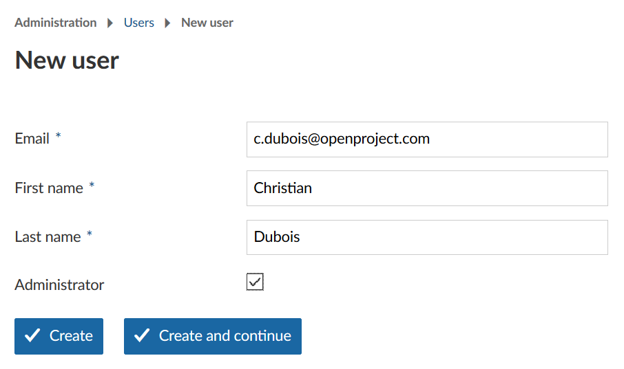
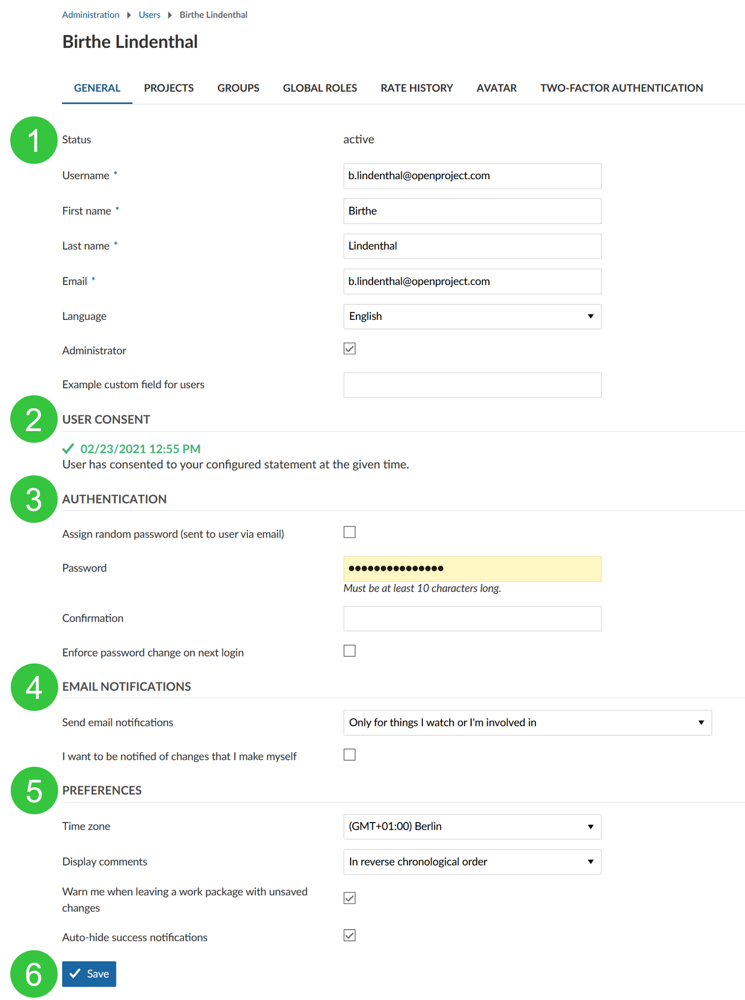
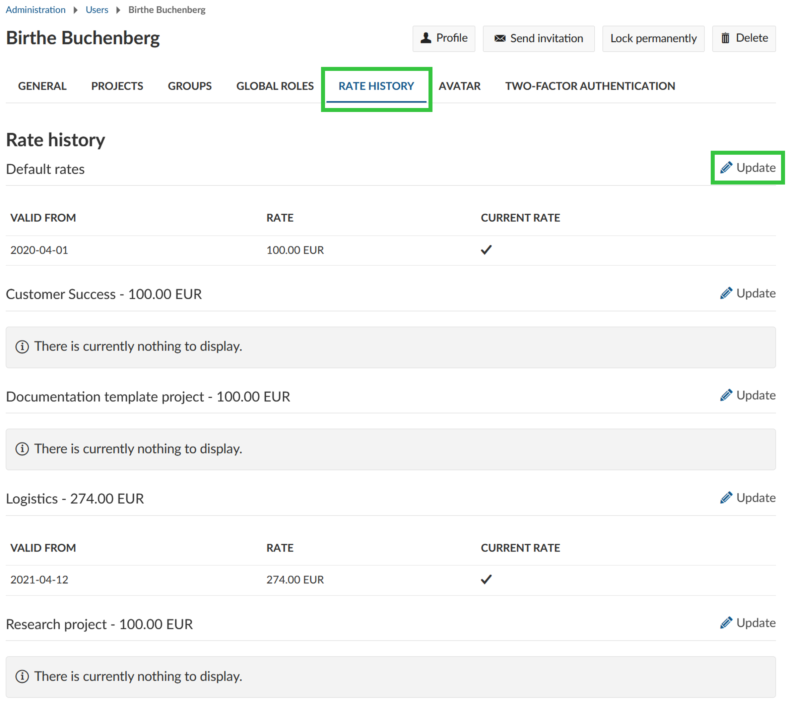

---
sidebar_navigation:
  title: Manage users
  priority: 990
description: Manage users in OpenProject.
robots: index, follow
keywords: manage users, lock, unlock, invite, default language
---

# Manage users

The user list provides an overview of all users in OpenProject. You can create new users, make changes to existing user accounts and block or delete users from the system. 

**User** is defined as a person (described by an identifier) who uses OpenProject. Users can become project members by assigning them a role and adding them via the project settings.

To manage users click on your avatar (top right corner) and select *Administration*. Select *Users & Permissions -> Users*. The list of current users is shown.

In the Community Edition there is no limit to the number of users. In Enterprise editions (cloud and on-premises) the user limit is based on your subscription. The number of users for your subscription is thus not bound to names. For example, if you block a user you can add a new one without upgrading. 

| Topic                                           | Content                                                  |
| ----------------------------------------------- | -------------------------------------------------------- |
| [User list](#user-list)                         | Manage all users in OpenProject.                         |
| [Filter users](#filter-users)                   | Filter users in the list.                                |
| [Lock and unlock users](#lock-and-unlock-users) | Block a user permanently in the system or unlock a user. |
| [Create users](#create-users)                   | Invite or create new users. Resend or delete user invitations                              |
| [Manage user settings](#manage-user-settings)   | Manage user details.                                     |
| [Authentication](#authentication)               | Set and use authentication methods.                      |
| [Delete users](#delete-users)                   | Delete a user from the system.                           |

## User list

The User list is where users are managed. They can be added, edited or deleted from this list, which can be filtered if required.

Column headers can be clicked to toggle sort direction. Arrows indicate sort order, up for ascending (a-z/0-9) and down for descending (z-a/9-0). Paging controls are shown at the bottom of the list. You will also see whether a user is a system administrator in OpenProject.

## Filter users

At the top of the user list is a filter box. Filter by status or name, then click the blue **Apply** button to filter the list. Click the **Clear** button to reset the filter fields and refresh the list.

* **Status** - select from Active, All or Locked Temporarily. Each selection shows the number of users.
* **Name** - enter any text; this can contain a "%" wild card for 0 or more characters. The filter applies to user name, first name, last name and email address.

## Lock and unlock users

Handling locking and unlocking of users is also done from the user list. To disable a user's access click the **Lock permanently** link next to a user. Use the **Unlock** link to restore the user's access.

If you are using [Enterprise cloud](../../../cloud-edition-guide) or [Enterprise on-premises](../../../enterprise-edition-guide) locking a user will make a new user available to add to the system within your booked plan.

**Note**: The previous activities from a locked user will still be displayed in the system.

If a user has repeated failed logins the user will be locked temporarily and a "Reset failed logins" link is shown in the user list. Click the link to unlock it now, or wait and it will be unlocked automatically. Have a look at the section [Other authentication settings](../../authentication/authentication-settings/#other-authentication-settings) for failed attempts and time blocked.

## Create users

New users can be created and configured by an administrator or by the users themselves (if activated). 

### Invite user (as administrator)

In the user list, click the **+User** button to open the "New user" form.

Enter the email address, first name, and last name of the new user. Tick the box to make them a system administrator user.

Note: the email field must be a valid format and be unique or it will be rejected on clicking the button.

Click the **Create** button to add the user and show that user's details page. Click the **Create and continue** button to add the user and stay on the new user form to add another user. Either way, the new user will be invited via email.
When adding the last of multiple users you can click on **Create** or click the **Users** link in the menu on the left. The Users list is shown. Click each user in turn to [edit their details](#set-initial-details).

### Create user (via self-registration)

To allow users to create their own user accounts allow self-registration in the [authentication settings](../../authentication/authentication-settings). A person can then create their own user from the home page by clicking on the "Sign in" button (top right), then on the "Create a new account" link in the sign in box. 

Enter values in all fields (they cannot be left blank). The email field must be a valid email address that is not used in this system. Click the **Create** button. Depending on the [settings](../../authentication/authentication-settings) the account is created but it could be that it still needs to be activated by an administrator.

#### Activate users

Open the user list. If a user has created their own account (and it has not been activated automatically) it is shown in the user list with an "Activate" link on the right. Click this link and continue to add details to this user as below. There is also an "Activate" button at the top of the user's details page.

### Set initial details

You can edit the details of a newly created user. Useful fields might be Username, Language and Time zone. You might also fill Projects, Groups and Rates, or leave these to the "Project creator".
Also consider the [authentication](#authentication) settings. 

See [Manage user settings](#manage-user-settings) for full details.

### Resend user invitation via email

If a user did not receive the email invitation or shall change their authentication method to email, you can send the invitation to the user again if needed. In the user list, click on the user name to whom you want to resend the email with the invitation link to the system.

In the top right, click the **Send invitation** button in order to send the email once again.

### Delete user invitations
To invalidate or revoke a user's invitation click on the user name and then on **Delete** in the upper right corner. This will prevent the invited user from logging in. 
Please note: This only works for users who haven't logged in yet. If the user is already active this will delete his/her whole profile and account. Deleting users can't be easily revoked.

## Manage user settings

You can manage individual user details if you click on the user name in the list. These settings will overwrite the individual user's settings set in their My Account settings.

### General settings

On the General tab the following fields are shown:

1. User's master date
   - **Status** - this is set by the system.
   - **Username** - this defaults to the email address for a new user (unless the user used the self registration). It can be changed on this page. Users cannot change their own user name.
   - **First name**, **Last name**, **Email** - these fields are filled from the New user page. Users can change them on their Profile page; they are mandatory.
   - **Language** - this defaults from the [user settings](../settings/#default-preferences). Users can change this on their Profile page.
   - **Administrator** - activate or deactivate this global role. Users cannot change this.
   - **Custom Fields** - if these have been created they are shown here. Use it for e.g. department or phone number.
2. **User consent** - if this has been [configured](../settings/#user-consent) (i.e. if the box next to "Consent required" is ticked) the consent status is shown here.
3. **Authentication** - the content of this section depends on the type of [authentication method](#authentication) being used (e.g. password, OpenID, Kerberos, etc.)
4. **Email notifications** - this defaults from the [Email notification settings](../../email/#email-notifications-settings). Users can change this on their Profile page.
5. **Preferences** - users can change these on their Profile page. Time zone defaults from chosen language. "Auto-hide success notifications" means that notifications will automatically be removed after some seconds, not that there are no success notifications at all.
6. Do not forget to **Save** your changes.

### Add users to a project

In order to see and work in a project, a user has to be a member of a project and needs to be added with a certain role to this project.

On the **Projects** tab, select the new project from the drop-down list, choose the [**roles**](../roles-permissions) for this project and click the blue **Add** button.

### Add users to groups

On the **Groups** tab you can see the groups the user belongs to. If a group is shown, click the group name link. If no groups are shown (i.e. the user does not belong to any group, yet), click the **Manage groups** link to [edit groups](../groups).

**Please note**: The Groups tab is only shown if at least one user group exists in OpenProject.

### Global roles

In order to add a global role to a user, at least one global role needs to be [created](../roles-permissions) in the system (a role with the "Global role" field ticked).

On the **Global roles** tab, select or de-select the global role(s) for this user. Click the **Add** button.

### Rate history

The rate history tab shows the hourly rates that have been defined for the user. The "Default rate" is applied to projects with no rate defined. All projects that the user is a member of are listed with the user's rates.

The "Valid from" date will effect the rate used when creating a [budget](../../../user-guide/budgets/) and when [logging time](../../../user-guide/time-and-costs/time-tracking/).

If you want to set a different hourly rate for the user on different projects, you can overwrite the default rate with a different rate below in the respective projects.

To enter a new hourly rate, click on the **Update** icon next to the rate history. You can either set a **default hourly rate** or define a rate for a certain project.

1. Enter a date from which the rate is **Valid from**.
2. Enter the (hourly) **Rate**. The currency can only be changed in the [respective settings](../../time-and-costs).
3. You can delete an hourly rate.
4. You can **add a rate** for a different time period.
5. **Save** your changes.

### Avatar

The **Avatar** tab shows the default icon to be shown for this user. A custom image can be uploaded as the avatar. In addition, the users can also use their [Gravatar](https://en.wikipedia.org/wiki/Gravatar). The user can manage this in their Profile. These features can be disabled in the [avatar settings](../avatars).

### Two-factor authentication (2FA)
This tab shows whether a user has activated a device for two-factor authentication in their account. You can see the devices and delete them if necessary. 
Please note: As this is a [premium feature](https://www.openproject.org/enterprise-edition/#premium-features) this tab won't be visible in the Community Edition. 

## Authentication

The available authentication methods affect the content of the Authentication section in the General tab of the user details. 

Use the **self-registration** field to give the following controls over a new user's access.

### Manual account activation

The user details Authentication section has fields **Assign random password**, **Password**, **Confirmation** and **Enforce password change**.

* If you are near the new user, you can enter a password and confirmation then tell the user what it is. They can then sign in. It is recommended that you also tick the enforce password change tickbox, so that the user is prompted to change their password after they sign in.
* You can phone the new user or send them an email, not using OpenProject, to give them the password. In this case it is more important to tick the enforce password change tickbox.
* Tick the Assign random password, and probably the enforce password change tickbox. When the details are saved OpenProject will send an email to the new user with their password.

### Account activation by email

Leave all fields blank. When the details are saved OpenProject will send an email to the new user with a link inviting the user to OpenProject. They click the link to get the registration page to complete creating their account.

## Delete users

Two [settings](../settings/#user-deletion/) allow users to be deleted from the system:
* **User accounts deletable by admins** - if ticked, a "Delete" button is shown on the user details page.
* **Users allowed to delete their accounts** - if ticked, a "Delete account" menu entry is shown in the "My Account" page.

To delete another user's account open the [user list](#user-list). Click on the **user name** of the user which you want to delete. Click the **Delete** button at the top right.

You will then be asked to type in the username in order to delete the user permanently from the system, then confirm this with your password.

**Note**: Deleting a user account is an irreversible action and cannot be reversed. The previous activities from this user will still be displayed in the system but reassigned to "deleted user".

